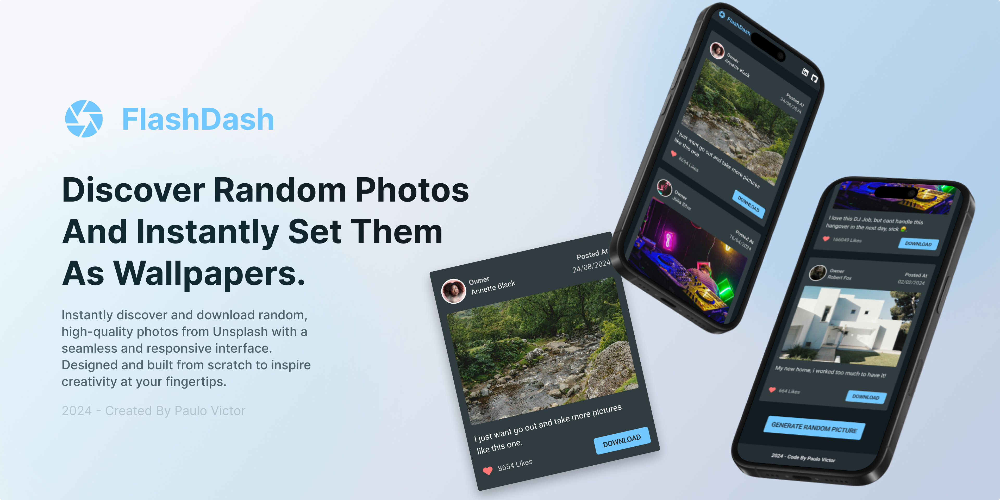

<p align="center">
 <br>
Important links<br>
<a href="https://www.linkedin.com/in/paulopbi/">Linkedin</a> • <a href="https://github.com/paulopbi">Github</a> • <a href="https://www.behance.net/paulopbi">Behance</a> • <a href="https://www.figma.com/design/xwy4ELBS248NDqluvTWu58/Unsplash-API?m=auto&t=lcRGgUNS2douRevJ-1">Figma</a> • <a href="https://paulopbi.github.io/flashdash/">Live Demo</a>
</p>

$\color{#71C8FF}{\textsf{FlashDash Instantly discover and download random photos with high-quality with a seamless and responsive interface.}}$ Designed and built from scratch to inspire creativity at your fingertips.

<p align="center">

</p>

This project is built with **Vite**, **React JS**, styled with **Tailwind CSS**, and integrated with the **Unsplash API** to provide a collection of random photos. It allows users to **download any image** that is displayed.

### Some Features:

- Responsive design, works perfectly across all screen sizes.
- Random photo fetching via the [Unsplash API](https://unsplash.com/documentation).
- Users can download the pictures.
- Designed entirely by me on [Figma](https://www.figma.com/design/xwy4ELBS248NDqluvTWu58/Unsplash-API?m=auto&t=lcRGgUNS2douRevJ-1).
- Includes ESLint for code quality and best practices.

### Technologies Used

- Figma.
- Vite.
- React JS.
- Tailwind CSS.
- Unsplash API.
- ESLint.

### Design

The design was crafted in **Figma**. You can check out the design details here: [Figma](https://www.figma.com/design/xwy4ELBS248NDqluvTWu58/Unsplash-API?m=auto&t=lcRGgUNS2douRevJ-1).

<p align="center">
<iframe style="border: 1px solid rgba(0, 0, 0, 0.1);" width="800" height="450" src="https://embed.figma.com/design/xwy4ELBS248NDqluvTWu58/Unsplash-API?embed-host=share" allowfullscreen></iframe>
</p>

### Clone

Feel free to fork this project or clone it, to run this project locally, follow these steps:

Clone the repository

```bash
git clone https://github.com/paulopbi/flashdash
```

Install dependencies:

```bash
npm install
```

Start the development server:

```bash
npm run dev
```

### License

This project is open-source under the MIT License.
